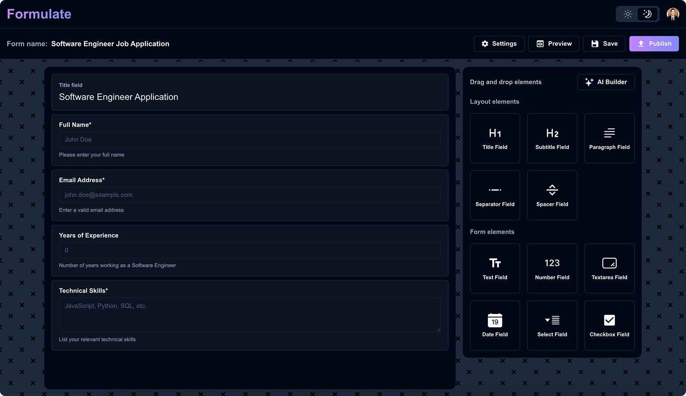

  
  
<em>Design custom forms effortlessly, share instantly, and track performance seamlessly.</em>

## Features
### Effortless Form Building!

* Drag, drop, and design custom forms for job applications, surveys, and more — no coding needed.

### Instant Sharing
* Publish your forms with a unique URL, making it easy to share with your audience.

### Smarter Insights
* Track visits, submissions, submission rates and bounce rates to improve engagement and performance.

## FAQs

<strong>How do I create a form with Formulate?</strong>

   
Simply drag and drop form elements like text fields, textareas, and selects onto your canvas. Customize each element, then publish your form.

<strong>Can I track how my form is performing?</strong>

   
Yes! Formulate provides insights on visits, submissions, and bounce rates, on your dashboard helping you measure engagement.

<strong>Do I need coding skills to use Formulate?</strong>

   
Not at all! Formulate’s drag-and-drop tool makes it easy for anyone to build professional forms without writing a single line of code.

<strong>Is there a limit to how many forms I can create?</strong>

   
No, Formulate allows you to create unlimited forms, giving you the flexibility to build as many as you need.

